# Agentic Reviewer Demo

**LLM-powered semantic auditing for text classification — no API keys, runs locally, free.**

## System Overview

```mermaid
flowchart LR
    subgraph Input
        A[Synthetic Data<br/>Generator] --> B[Classification<br/>Samples]
    end
    
    subgraph "LLM Review Engine"
        B --> C{Ollama<br/>Local LLM}
        C --> D[Semantic<br/>Analysis]
        D --> E[Verdict +<br/>Corrections]
    end
    
    subgraph Output
        E --> F[Labeled Dataset]
        E --> G[Audit Report]
        E --> H[Metrics JSON]
    end
    
    style C fill:#4a5568,stroke:#718096
    style D fill:#2d3748,stroke:#4a5568
    style E fill:#2d3748,stroke:#4a5568
```



**Example Flow:**

| Step | Input | Output |
|------|-------|--------|
| 1 | `"Delete my data permanently"` | Predicted: Access Request (85%) |
| 2 | LLM semantic analysis | Verdict: Incorrect |
| 3 | Correction suggested | Suggested: Erasure |
| 4 | Reasoning generated | "Text requests deletion, not data access" |

---

## Quick Start (3 steps)

### 1. Install Ollama (free, local LLM runtime)

Download from **[ollama.ai/download](https://ollama.ai/download)** — works on Mac, Windows, Linux.

Then start it:
```bash
ollama serve
```

### 2. Clone & Install

```bash
git clone https://github.com/YOUR_USERNAME/agentic-reviewer-demo.git
cd agentic-reviewer-demo
pip install -r requirements.txt
```

### 3. Run

```bash
python run_demo.py
```

**The script auto-downloads the LLM model on first run.** No API keys. No cloud. Everything local.

Check `outputs/` for generated artifacts.

---

## What It Does

1. **Generates** synthetic GDPR/CCPA data subject requests
2. **Reviews** each prediction using LLM semantic analysis
3. **Corrects** misclassifications with reasoning
4. **Produces** traceable artifacts (CSV, JSON, Markdown report)

---

## Output Artifacts

```
outputs/2024_12_04_153000/
├── 00_config.json          # Run configuration (reproducibility)
├── 01_synthetic_data.csv   # Generated classification samples
├── 02_review_results.json  # Full LLM responses
├── 03_labeled_dataset.csv  # Corrected labels with reasoning
├── 04_report.md            # Analysis report
└── 05_metrics.json         # Accuracy statistics
```

---

## Terminal Output

```
+==============================================================+
|                    AGENTIC REVIEWER DEMO                     |
+==============================================================+
| Run ID: 2024_12_04_153000                                    |
| Samples: 15 | Seed: 42 | LLM: On                             |
+--------------------------------------------------------------+
| PHASE 1: Generate Synthetic Data       [OK] 15 samples       |
| PHASE 2: LLM Review                    [OK] 15/15 reviews    |
| PHASE 3: Generate Report               [OK] 450 words        |
| PHASE 4: Save Artifacts                [OK] 5 files          |
+--------------------------------------------------------------+
| RESULTS                                                      |
|   Correct:    10 (66.7%)                                     |
|   Incorrect:   4 (26.7%) -> corrections suggested            |
|   Uncertain:   1 (6.6%)                                      |
+==============================================================+
```

---

## Demo Options

```bash
# Standard demo (12 samples)
python run_demo.py

# More samples
python run_demo.py --samples 25

# Reproducible run
python run_demo.py --seed 42

# Quick preview without LLM (for CI/testing)
python run_demo.py --mock

# Enable verbose/debug logging
python run_demo.py --verbose
```

### Why Ollama?

| Feature | Ollama | Cloud APIs |
|---------|--------|------------|
| **Cost** | Free | Pay per token |
| **API Keys** | None needed | Required |
| **Privacy** | Data stays local | Sent to cloud |
| **Setup** | 1 download | Account signup |
| **Works offline** | Yes | No |

---

## What This Demonstrates

| Skill | Evidence |
|-------|----------|
| **LLM Integration** | Ollama orchestration, prompt engineering |
| **Data Engineering** | Synthetic generation, schema validation |
| **MLOps Patterns** | Reproducibility, artifact management |
| **Code Quality** | Clean architecture, type hints, error handling |

---

## Project Structure

```
agentic-reviewer-demo/
├── run_demo.py              # Single entry point
├── requirements.txt         # Pinned dependencies
├── pyproject.toml           # Project configuration (mypy, ruff, pytest)
├── core/
│   ├── synthetic_generator.py  # Data generation with configurable confusion
│   ├── review_engine.py        # LLM review with caching & parallelism
│   ├── report_generator.py     # Markdown report generation
│   └── logging_config.py       # Structured logging configuration
├── configs/
│   └── labels.yaml          # GDPR/CCPA label definitions
├── tests/                   # Pytest test suite
│   ├── test_synthetic_generator.py
│   ├── test_review_engine.py
│   ├── test_report_generator.py
│   └── test_integration.py  # End-to-end integration tests
├── .github/workflows/       # CI configuration
│   └── ci.yml               # Tests, linting, type checking, security scan
└── outputs/                 # Generated runs
```

---

## Testing

Run the test suite:

```bash
# Install test dependencies
pip install pytest pytest-cov pytest-asyncio

# Run all tests
pytest tests/ -v

# Run with coverage
pytest tests/ -v --cov=core --cov-report=term-missing
```

---

## Architecture Highlights

| Feature | Implementation |
|---------|---------------|
| **Prompt Caching** | MD5 hash-based cache with versioning for invalidation |
| **Parallel Execution** | `asyncio.gather()` + semaphore for concurrent reviews |
| **Retry with Backoff** | Exponential backoff for Ollama resilience |
| **Configurable Confusion** | Static patterns or dynamic semantic similarity |
| **Structured Logging** | Configurable logging with `--verbose` debug mode |
| **Robust Parsing** | Regex-based response parsing with fallback |

---

## Production Version

This is a **minimal demo** for quick validation. For the full production implementation with:

- Security layer (prompt injection detection)
- LRU caching + circuit breaker
- FastAPI REST interface
- System monitoring & health checks
- SQLite audit logging

See: **[agentic-reviewer](https://github.com/naaas94/agentic-reviewer)**

---

## License

MIT

---

*Built to demonstrate LLM-powered classification auditing.*
