# Agentic Reviewer Demo

**LLM-powered semantic auditing for text classification — no API keys, runs locally, free.**

## System Overview

```mermaid
flowchart LR
    subgraph Input
        A[Synthetic Data<br/>Generator] --> B[Classification<br/>Samples]
    end
    
    subgraph "LLM Review Engine"
        B --> C{Ollama<br/>Local LLM}
        C --> D[Semantic<br/>Analysis]
        D --> E[Verdict +<br/>Corrections]
    end
    
    subgraph Output
        E --> F[Labeled Dataset]
        E --> G[Audit Report]
        E --> H[Metrics JSON]
    end
    
    style C fill:#4a5568,stroke:#718096
    style D fill:#2d3748,stroke:#4a5568
    style E fill:#2d3748,stroke:#4a5568
```



**Example Flow:**

| Step | Input | Output |
|------|-------|--------|
| 1 | `"Delete my data permanently"` | Predicted: Access Request (85%) |
| 2 | LLM semantic analysis | Verdict: Incorrect |
| 3 | Correction suggested | Suggested: Erasure |
| 4 | Reasoning generated | "Text requests deletion, not data access" |

---

## Quick Start (3 steps)

### 1. Install Ollama (free, local LLM runtime)

Download from **[ollama.ai/download](https://ollama.ai/download)** — works on Mac, Windows, Linux.

Then start it:
```bash
ollama serve
```

### 2. Clone & Install

```bash
git clone https://github.com/YOUR_USERNAME/agentic-reviewer-demo.git
cd agentic-reviewer-demo
pip install -r requirements.txt
```

### 3. Run

```bash
python run_demo.py
```

**On first run, the script may prompt to download a local LLM model.** For non-interactive runs (CI/headless demos), use `--yes` to auto-download.

Check `outputs/` for generated artifacts.

**Performance Note:** The system uses persistent caching (SQLite) by default. Cache is stored in `.cache/prompt_cache.db` and persists across runs for faster subsequent executions. Use `--no-persistent-cache` to disable.

---

## Demo Presets

### `--demo-fast` (Recommended for Sales Engineers)

Optimized for **quick, reliable demos** on sales laptops:

- **8 samples** (faster completion)
- **max_concurrent=1** (most reliable across machines)
- **num_predict=150** (shorter responses, faster inference)
- **temperature=0.1** (low variance, consistent results)
- **timeout=120s** (reasonable for slower machines)

**Usage:**
```bash
python run_demo.py --demo-fast
```

Perfect for: Sales demos, quick validation, unreliable network conditions

### `--benchmark` (For Performance Testing)

Deterministic, reproducible mode for **benchmarking and testing**:

- **12 samples** (standard test size)
- **max_concurrent=1** (eliminates concurrency variance)
- **temperature=0.0** (fully deterministic outputs)
- **num_predict=200** (standard response length)

**Usage:**
```bash
python run_demo.py --benchmark --seed 42
```

Perfect for: Performance regression testing, reproducible benchmarks, CI/CD validation

---

### Troubleshooting

**If Ollama is installed on a different drive (e.g., D:):**

Ollama stores models in `C:\Users\<username>\.ollama\models\` by default. If you have limited space on C: or installed Ollama on D:, set the `OLLAMA_MODELS` environment variable:

**Windows PowerShell:**
```powershell
# Set permanently (requires restarting Ollama)
[System.Environment]::SetEnvironmentVariable("OLLAMA_MODELS", "D:\Apps\Ollama\models", "User")

# Or use the helper script:
.\setup_ollama_path.ps1
```

**Then restart Ollama** for the change to take effect.

**If models aren't detected:**
- Verify Ollama is running: visit `http://localhost:11434` in your browser
- Check available models: `ollama list`
- Download a model manually: `ollama pull mistral` (recommended) or `ollama pull llama3`
- Run non-interactively: `python run_demo.py --yes`

**Model Selection:**
The system automatically selects the best available model using this priority:
1. **Exact match** to `--model` argument (if specified)
2. **Prefix match** (e.g., "mistral" matches "mistral:latest")
3. **Best available** from preference list (Mistral > Llama 3.x > Gemma > Phi > others)
4. **Any available model** as fallback

The system prefers instruction-tuned models (better for structured output) over code models. Use `--verbose` to see which model was selected and why.

---

## What It Does

1. **Generates** synthetic GDPR/CCPA data subject requests
2. **Reviews** each prediction using LLM semantic analysis
3. **Corrects** misclassifications with reasoning
4. **Produces** traceable artifacts (CSV, JSON, Markdown report)

---

## Output Artifacts

```
outputs/2024_12_04_153000/
├── 00_config.json          # Run configuration (reproducibility, validation settings)
├── 01_synthetic_data.csv   # Generated classification samples (optionally redacted)
├── 02_review_results.json  # Full LLM responses (with _untrusted markers, validation issues)
├── 03_labeled_dataset.csv  # Corrected labels with reasoning (untrusted markers)
├── 04_report.md            # Analysis report (includes untrusted output warning banner)
└── 05_metrics.json         # Accuracy statistics (with validation failure counts)
```

**Security Notes:**
- All LLM outputs include `_untrusted: true` metadata flag
- Reports include prominent warning banners about unverified content
- Use `--redact` to mask potentially sensitive text in outputs
- Validation issues are logged in `_validation_issues` field when present

---

## Terminal Output

```
+==============================================================+
|                    AGENTIC REVIEWER DEMO                     |
+==============================================================+
| Run ID: 2024_12_04_153000                                    |
| Samples: 15 | Seed: 42 | LLM: On                             |
+--------------------------------------------------------------+
| PHASE 1: Generate Synthetic Data       [OK] 15 samples       |
| PHASE 2: LLM Review                    [OK] 15/15 reviews    |
| PHASE 3: Generate Report               [OK] 450 words        |
| PHASE 4: Save Artifacts                [OK] 5 files          |
+--------------------------------------------------------------+
| RESULTS                                                      |
|   Correct:    10 (66.7%)                                     |
|   Incorrect:   4 (26.7%) -> corrections suggested            |
|   Uncertain:   1 (6.6%)                                      |
+==============================================================+
```

---

## Demo Options

### Presets (Recommended for Sales Engineers)

```bash
# Quick, reliable demo preset (8 samples, max reliability, optimized for laptops)
python run_demo.py --demo-fast

# Deterministic benchmark mode (reproducible, temperature=0, for performance testing)
python run_demo.py --benchmark
```

### Basic Options

```bash
# Standard demo (12 samples)
python run_demo.py

# More samples
python run_demo.py --samples 25

# Reproducible run
python run_demo.py --seed 42

# Quick preview without LLM (for CI/testing)
python run_demo.py --mock

# Auto-download model if needed (no prompts)
python run_demo.py --yes
```

### Performance Optimizations

```bash
# Performance optimizations (enabled by default)
python run_demo.py --persistent-cache    # Enable SQLite cache (default: on)
python run_demo.py --no-persistent-cache # Disable persistent cache
python run_demo.py --compact-prompts    # Use shorter prompts (faster inference)
python run_demo.py --warmup              # Warm up model before batch (default: on)
python run_demo.py --no-warmup           # Skip model warm-up
python run_demo.py --cache-dir .cache    # Custom cache directory

# Auto-tune concurrency based on system resources (CPU, RAM, GPU, model size)
python run_demo.py --auto-tune

# Manual tuning for your machine
python run_demo.py --max-concurrent 1 --timeout 180 --num-predict 200
```

### Security & Privacy Options

```bash
# Redact potentially sensitive text in output artifacts
python run_demo.py --redact

# Disable strict output validation (not recommended - reduces security)
python run_demo.py --no-strict-validation
```

### Debugging

```bash
# Enable verbose/debug logging
python run_demo.py --verbose
```

### Why Ollama?

| Feature | Ollama | Cloud APIs |
|---------|--------|------------|
| **Cost** | Free | Pay per token |
| **API Keys** | None needed | Required |
| **Privacy** | Data stays local | Sent to cloud |
| **Setup** | 1 download | Account signup |
| **Works offline** | Yes | No |

---

## Performance Optimizations

The system includes several optimizations for faster execution:

| Optimization | Benefit | Default |
|--------------|---------|---------|
| **Persistent Cache** | SQLite-backed cache persists across runs, reducing redundant LLM calls | ✅ Enabled |
| **HTTP Connection Pooling** | Reused connections reduce latency by 20-30% | ✅ Enabled |
| **Model Warm-up** | Eliminates 2-5s cold-start latency on first request | ✅ Enabled |
| **Compact Prompts** | 40% fewer tokens, 10-20% faster inference | ❌ Optional (`--compact-prompts`) |
| **Pre-compiled Regex** | Faster response parsing | ✅ Enabled |

**Cache Location:** `.cache/prompt_cache.db` (auto-created, can be customized with `--cache-dir`)

**Disable optimizations:**
```bash
python run_demo.py --no-persistent-cache  # Disable disk cache
python run_demo.py --no-warmup            # Skip model warm-up
python run_demo.py --no-cache             # Disable all caching
```

### Auto-Tuning Concurrency

The `--auto-tune` flag automatically suggests optimal concurrency based on your system:

**Factors Considered:**
- **RAM**: Ensures sufficient headroom for model + OS + working memory
- **CPU Cores**: More cores allow higher concurrency (with sufficient RAM)
- **GPU VRAM**: High-end GPUs (16GB+) can handle more concurrent requests
- **Model Size**: Smaller models (Phi, TinyLlama) can handle more concurrency than large models (70B)

**Examples:**
- **Laptop (16GB RAM, no GPU)**: Suggests `max_concurrent=1` (safest)
- **Workstation (32GB RAM, 24GB VRAM GPU, small model)**: Suggests `max_concurrent=3`
- **Apple Silicon (16GB unified memory)**: Suggests `max_concurrent=2` for small models

**Usage:**
```bash
python run_demo.py --auto-tune  # Auto-detect and suggest optimal concurrency
```

The system will print the suggested concurrency and reasoning. You can still override with `--max-concurrent` if needed.

---

## Security & Output Integrity

The system includes multiple layers of defense against prompt injection and output manipulation:

### Output Validation

- **Strict Schema Validation**: Only accepts `Correct`, `Incorrect`, or `Uncertain` verdicts
- **Label Guardrails**: Rejects any suggested labels not defined in `labels.yaml`
- **Output Length Limits**: Truncates excessively long responses (defense against resource exhaustion)
- **Prompt Injection Detection**: Detects 20+ suspicious patterns including:
  - Instruction override attempts ("ignore previous instructions")
  - System role manipulation ("system:", "[INST]")
  - Jailbreak patterns ("DAN mode", "developer mode")
  - XSS/script injection attempts

### Data Privacy

- **PII Detection**: Automatically warns if potential PII (emails, phone numbers, SSNs) is detected
- **Redaction Mode**: `--redact` flag masks sensitive text in output artifacts
- **Untrusted Markers**: All LLM outputs are marked with `_untrusted: true` flag
- **Warning Banners**: Reports include prominent warnings about unverified LLM content

### Model Selection & Health

- **Intelligent Model Selection**: Prioritizes instruction-tuned models (Mistral, Llama 3.x) over code models
- **Exact Match Preference**: Uses exact model name if available, falls back to best available
- **GPU Detection**: Auto-detects NVIDIA, AMD, and Apple Silicon GPUs for optimal concurrency
- **Resource-Aware Tuning**: `--auto-tune` adjusts concurrency based on:
  - Available RAM
  - CPU cores
  - GPU VRAM (if available)
  - Model size (estimated from name)

**Example:** On a laptop with 16GB RAM and no GPU, `--auto-tune` will suggest `max_concurrent=1` for reliability. On a workstation with 32GB RAM and 24GB VRAM GPU, it may suggest `max_concurrent=3` for a small model.

---

## What This Demonstrates

| Skill | Evidence |
|-------|----------|
| **LLM Integration** | Ollama orchestration, prompt engineering, model selection |
| **Security Engineering** | Prompt injection detection, output validation, label guardrails |
| **Data Engineering** | Synthetic generation, schema validation, PII detection |
| **MLOps Patterns** | Reproducibility, artifact management, resource-aware tuning |
| **Code Quality** | Clean architecture, type hints, error handling, comprehensive tests |

---

## Project Structure

```
agentic-reviewer-demo/
├── run_demo.py              # Single entry point
├── requirements.txt         # Pinned dependencies
├── pyproject.toml           # Project configuration (mypy, ruff, pytest)
├── core/
│   ├── synthetic_generator.py  # Data generation with configurable confusion
│   ├── review_engine.py        # LLM review with caching, pooling & parallelism
│   ├── report_generator.py     # Markdown report generation
│   └── logging_config.py       # Structured logging configuration
├── configs/
│   └── labels.yaml          # GDPR/CCPA label definitions
├── tests/                   # Pytest test suite
│   ├── test_synthetic_generator.py
│   ├── test_review_engine.py
│   ├── test_report_generator.py
│   └── test_integration.py  # End-to-end integration tests
├── .github/workflows/       # CI configuration
│   └── ci.yml               # Tests, linting, type checking, security scan
├── outputs/                 # Generated runs
└── .cache/                  # Persistent prompt cache (SQLite, auto-created)
```

---

## Testing

Run the test suite:

```bash
# Install test dependencies
pip install pytest pytest-cov pytest-asyncio

# Run all tests
pytest tests/ -v

# Run with coverage
pytest tests/ -v --cov=core --cov-report=term-missing
```

---

## Architecture Highlights

### Performance Features

| Feature | Implementation |
|---------|---------------|
| **Prompt Caching** | Multi-level cache: L1 (in-memory) + L2 (SQLite persistent cache) with version-aware invalidation |
| **HTTP Connection Pooling** | Reused `aiohttp.ClientSession` with connection pooling for 20-30% latency reduction |
| **Model Warm-up** | Optional KV cache priming to eliminate 2-5s cold-start latency |
| **Compact Prompts** | Optional compressed prompt format (40% fewer tokens, 10-20% faster inference) |
| **Pre-compiled Regex** | Optimized response parsing with compiled patterns |
| **Parallel Execution** | `asyncio.gather()` + semaphore for concurrent reviews (default concurrency is conservative for reliability; configurable via CLI) |
| **Retry with Backoff** | Exponential backoff + HTTP-aware retry policy for Ollama resilience |
| **Resource-Aware Tuning** | Auto-detects CPU, RAM, GPU to suggest optimal concurrency |

### Security Features

| Feature | Implementation |
|---------|---------------|
| **Output Schema Validation** | Strict enum validation (Correct/Incorrect/Uncertain only) |
| **Label Guardrails** | Rejects labels not in `labels.yaml`, case-insensitive matching |
| **Prompt Injection Detection** | 20+ regex patterns detecting instruction override, jailbreak, XSS attempts |
| **Output Length Limits** | Truncates excessive reasoning/explanation (defense against resource exhaustion) |
| **PII Detection** | Heuristic detection of emails, phones, SSNs with warning prompts |
| **Untrusted Markers** | All LLM outputs tagged with `_untrusted: true` for downstream processing |

### Data & Reliability Features

| Feature | Implementation |
|---------|---------------|
| **Configurable Confusion** | Static patterns or dynamic semantic similarity |
| **Structured Logging** | Configurable logging with `--verbose` debug mode |
| **Robust Parsing** | Regex-based response parsing with fallback |
| **Model Selection** | Intelligent preference ordering (instruction-tuned > code models) |
| **Health Checks** | Ollama availability + model detection with helpful error messages |

---

## Production Considerations

This demo includes **production-ready security features**:

✅ **Implemented:**
- Prompt injection detection (20+ patterns)
- Output schema validation & label guardrails
- PII detection & redaction support
- Untrusted output markers & warning banners
- Resource-aware concurrency tuning
- Persistent caching with TTL

**For full production deployment, consider adding:**
- FastAPI REST interface
- LRU caching + circuit breaker
- System monitoring & health checks
- SQLite audit logging
- Rate limiting & authentication

See: **[agentic-reviewer](https://github.com/naaas94/agentic-reviewer)** for production implementation

---

## License

MIT

---

*Built to demonstrate LLM-powered classification auditing.*
